# Laboratorium nr 2 - "Rejestracja użytkowników"
## Stworzyłem aplikację webową obsługującą logowanie, rejestrowanie użytkowników. - https://dosiu28.pythonanywhere.com/account/
1. Aplikacja internetowa została postawiona na "PythonAnywhere".
* Ekranem startowym strony jest ekran logowania.
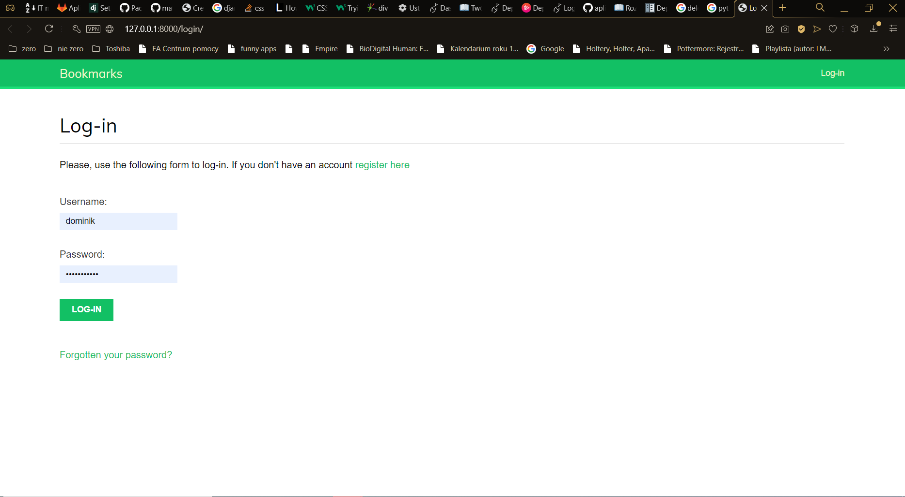
* Po wybraniu opcji "register here" użytkownik jest przenoszony do widoku rejestracji.
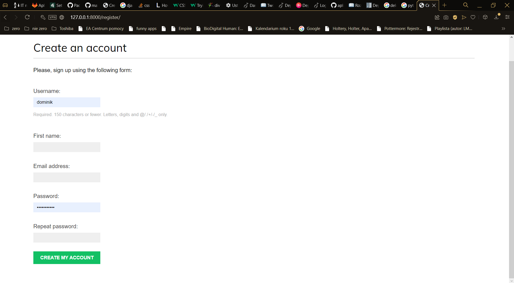
* Po prawidłowym wypełnieniu wymaganych pól i wybraniu opcji 'create account' pojawia się informacja o prawidłowym przebiegu rejestracji.
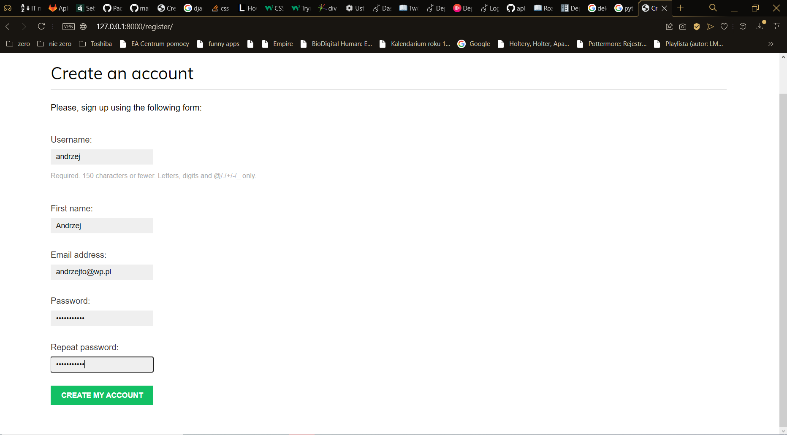
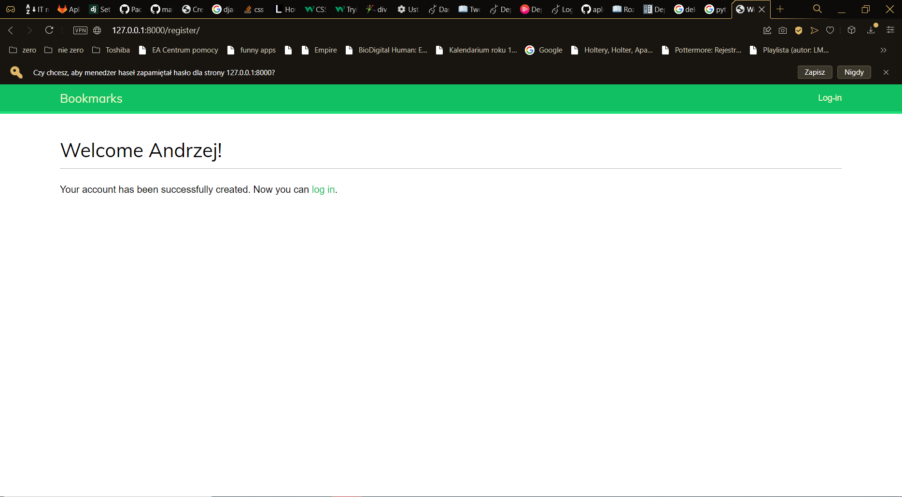
* Następnie za pomocą podanych danych użytkownik może się zalogować.
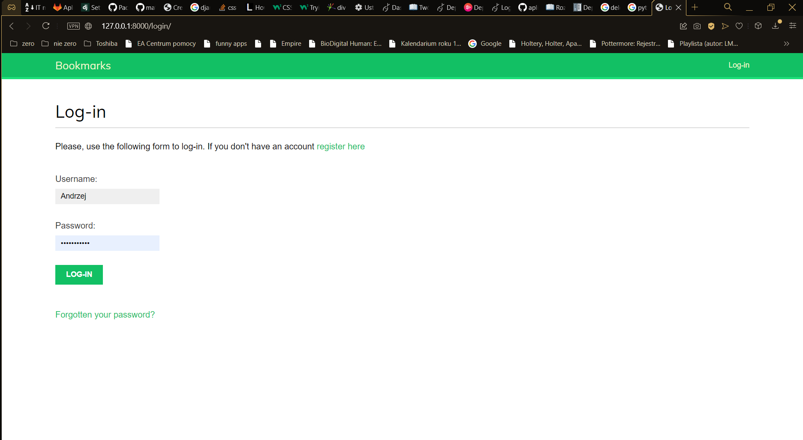
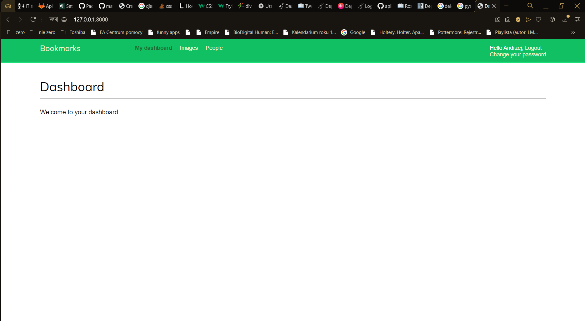
* W prawym górnym rogu pojawiają się dwie opcje: logout oraz change password.
* Po wybraniu opcji logout użytkownik zostaje wylogowany ze swojego konta.
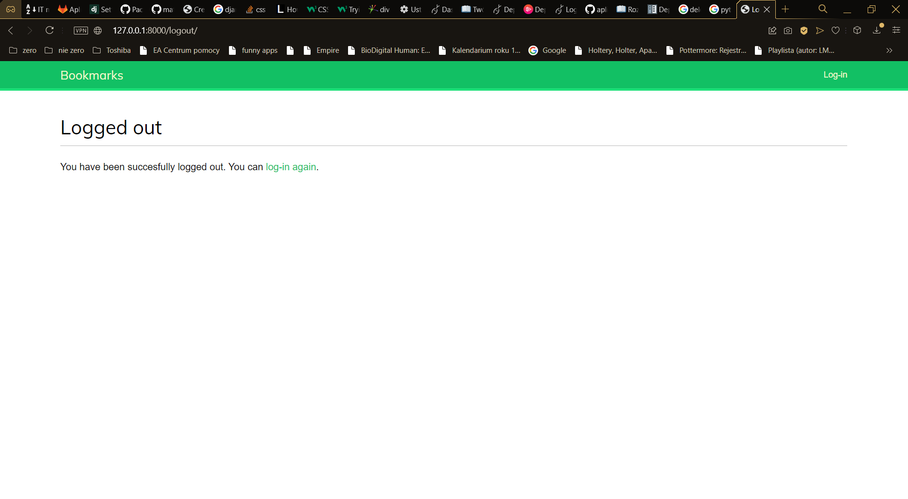
* Po wybraniu opcji change password użytkownik zostaje przeniesiony do widoku zmiany hasła.
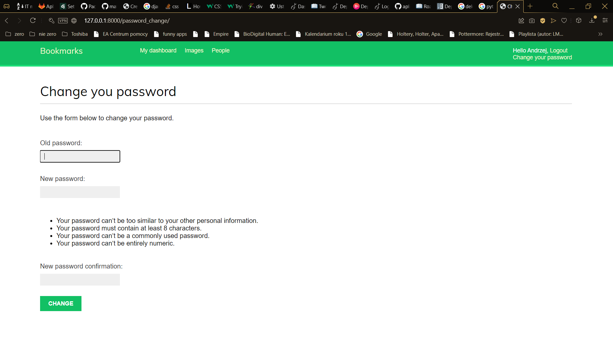
* Po wybraniu opcji forgotten password użytkownik zostaje przeniesiony do widoku przypominania hasła w którym po podaniu adresu e-mail przypisanego do jego konta dostaje link pozwalający na zmianę hasła.
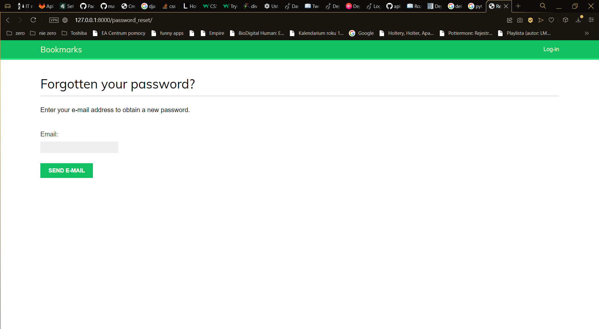
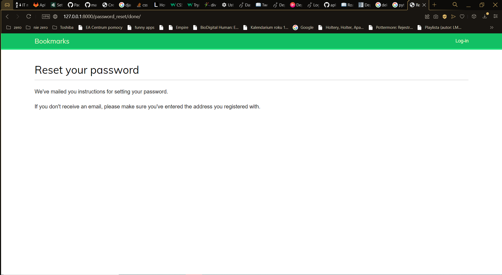
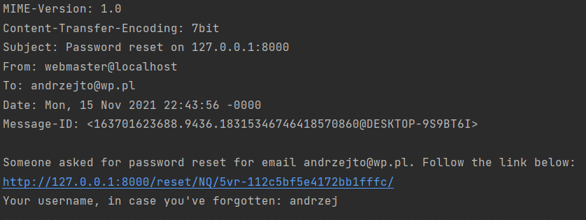
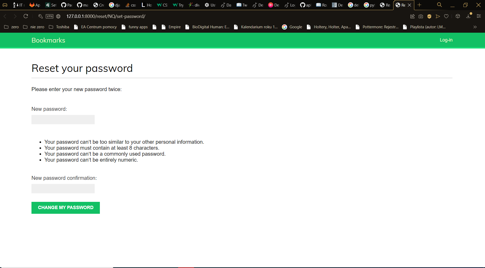
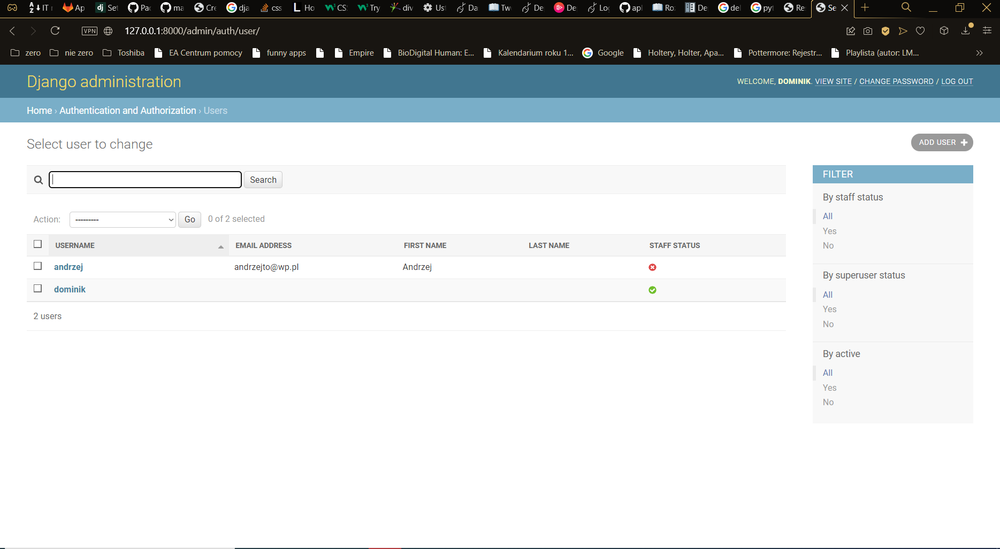
