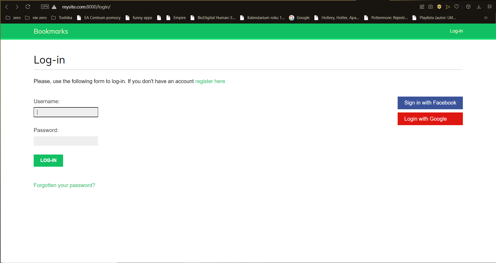
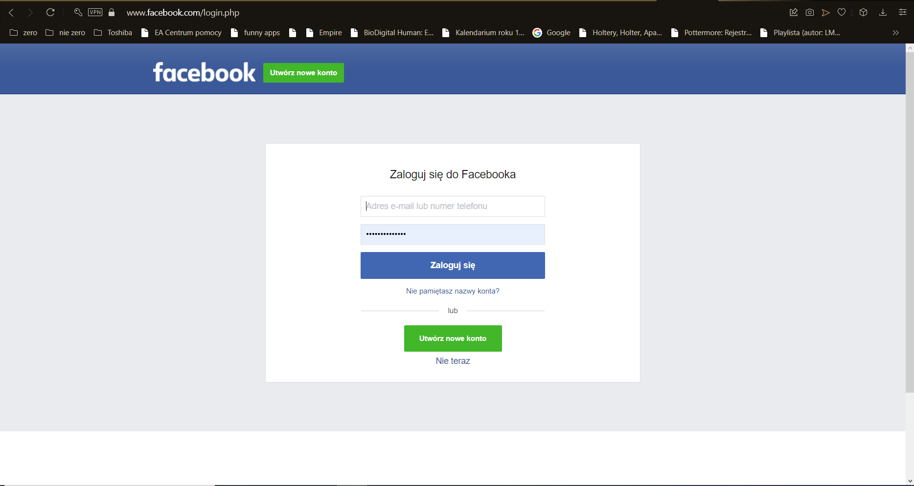
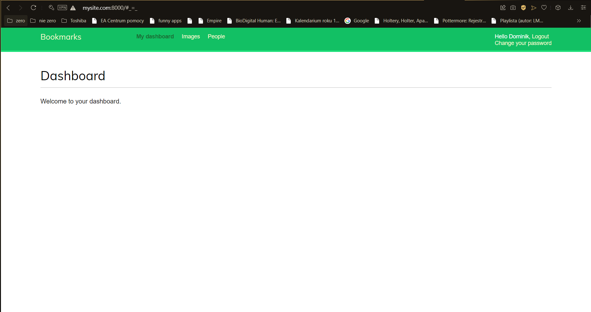
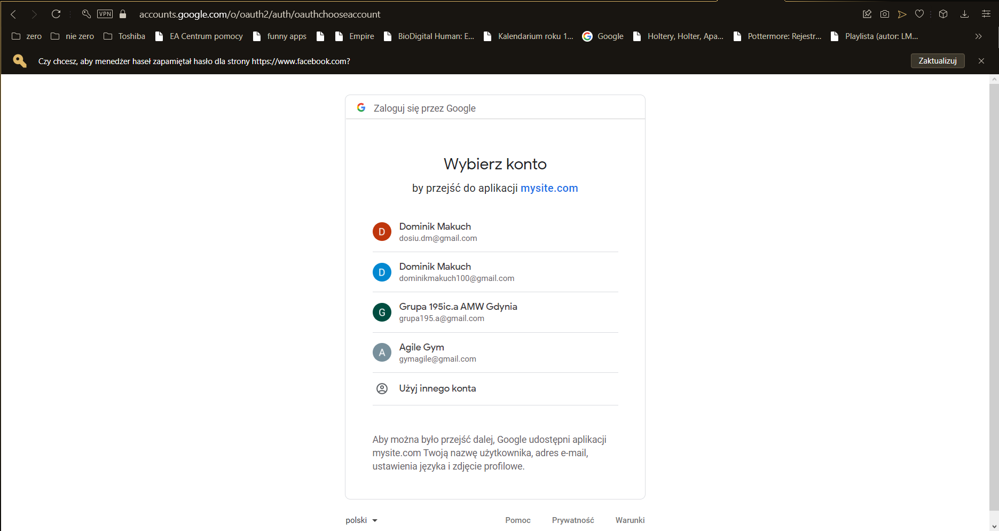
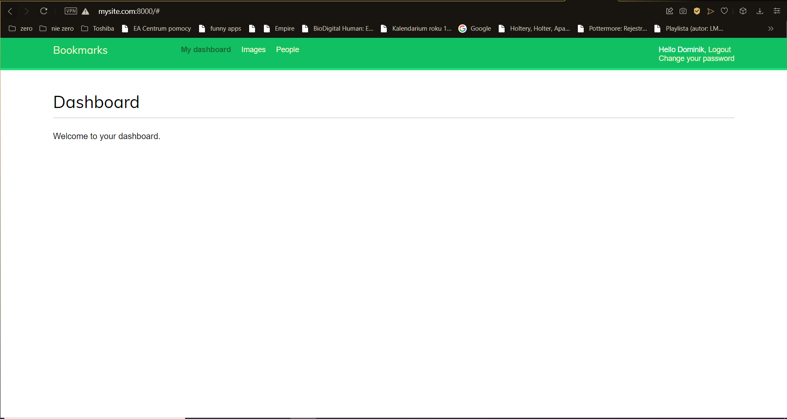

# Laboratorium nr 3 - Różne sposoby uwierzytelniania
## Do aplikacji z Lab2 dodałem możliwość uwierzytelniania na stronie za pomocą konta Facebook oraz Google
1. Na ekranie logowania dostępne są dwa nowe linki - logowanie przez Facebook oraz Google.

2. Po wciśnięciu opcji Facebook użytkownik zostaje przekierowany do okna logowania Facebook'a.

* Po prawidłowym wypełnieniu wymaganych pól, pojawia się informacja o prawidłowym przebiegu logowania.

3. Po wciśnięciu opcji Gooogle użytkownik zostaje przekierowany do okna logowania Google.

* Po prawidłowym wypełnieniu wymaganych pól, pojawia się informacja o prawidłowym przebiegu logowania.
