# Laboratorium nr 4 - REST API z DRF
## Stworzyłem api odpowiadające za obsługę postów na blogu jak i użytkowników tego bloga.
1. Widok panelu administratora zawiera wszystkie utworzone modele:
* Adresy E-mail,
* Tokeny,
* Użytkownicy i grupy,
* Posty,
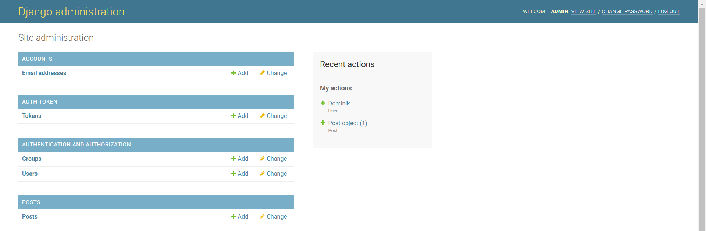
2. Został utworzony interfejs REST API.
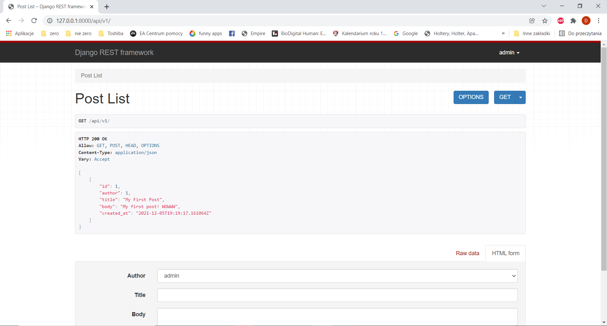
* Widoczna jest lista utworzonych postów. Dane dotyczące postów wyświetlane są dzięki serializerowi:
    - id: id posta tworzona automatycznie,
    - autor: id autora,
    - title: tytuł posta,
    - body: treść posta,
    - created_at: dane odnośnie czasu utworzenia posta.
* Poniżej widoczna jest opcja dodania nowego posta:
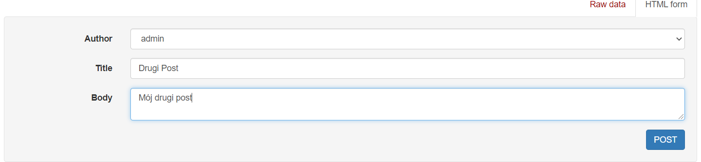
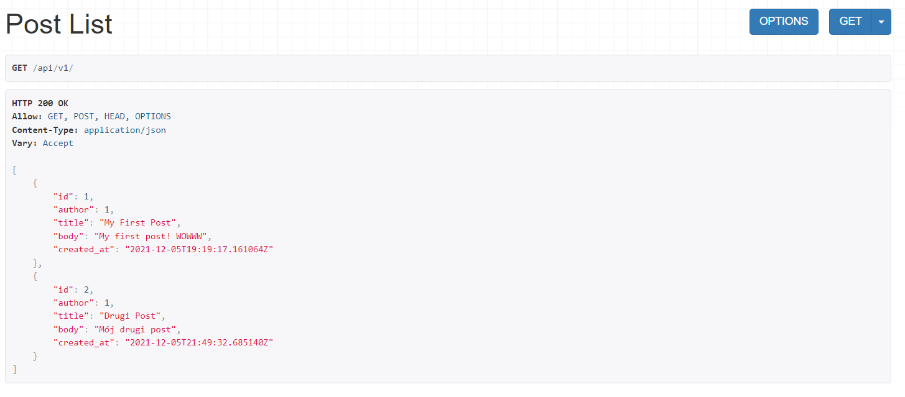
* Po wybraniu opcji 'GET -> JSON' dane wyświetlane są w postaci obiektu JSON.
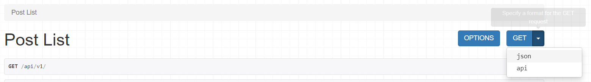
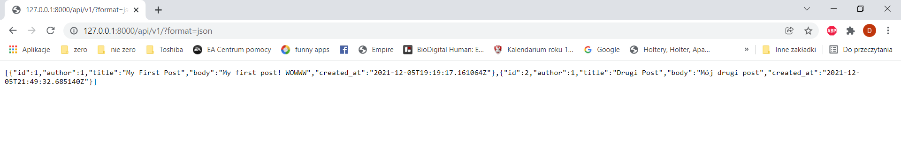
* Po wylogowaniu się, jako niezalogowany użytkownik mogę wyświetlić listę postów jednak nie mam dostępu do edycji poszczególnych postów np. (/api/v1/1):
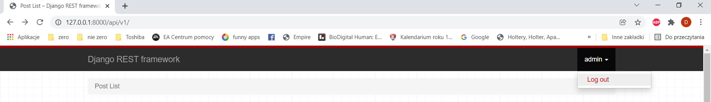
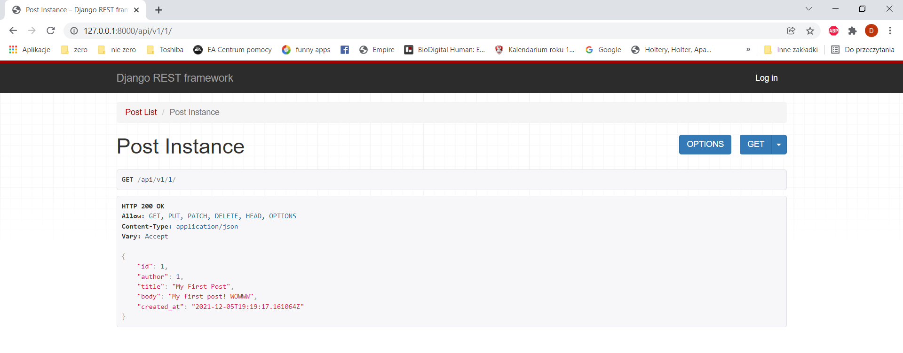
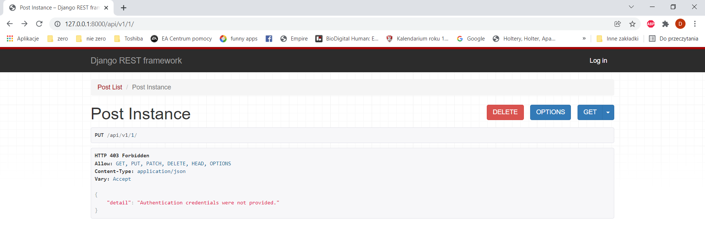
* Widoczna jest również lista użytkowników:
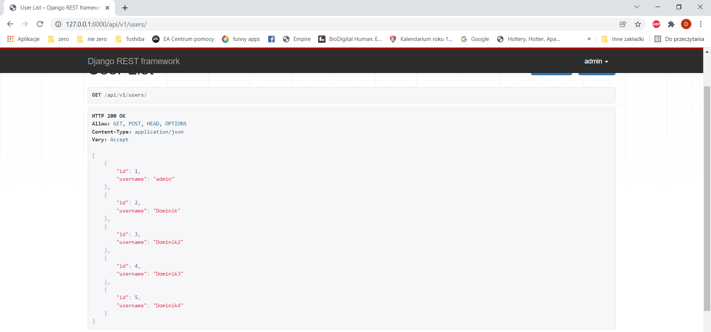
* Poniżej znajduje się możliwość dodania nowego użytkownika.
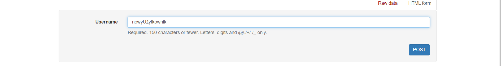
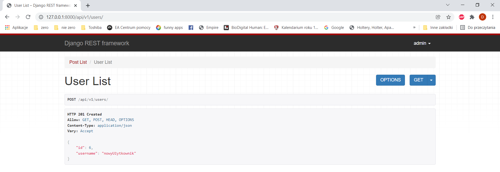
3. Po przejściu pod adres "/docs/" wyświetlana jest dokumentacja utworzonego API wraz z możliwością testowania poszczególnych elementów.
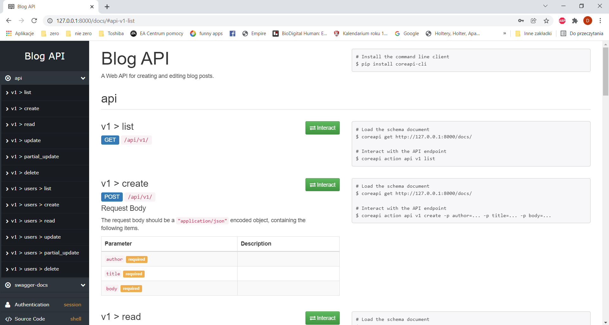
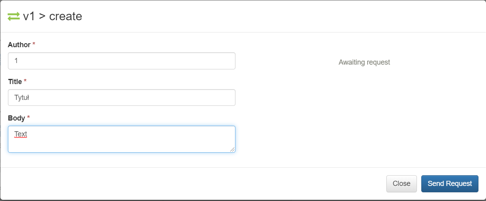
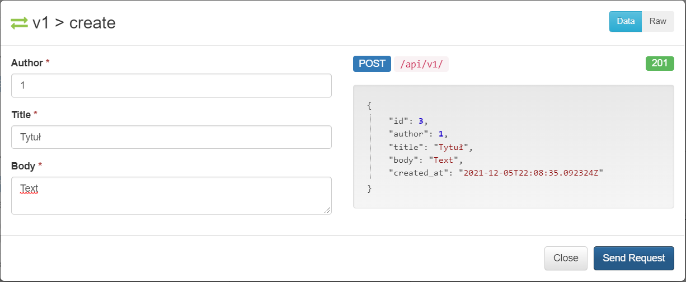
4. 'Swagger' został również skonfigurowany dla aplikacji: 
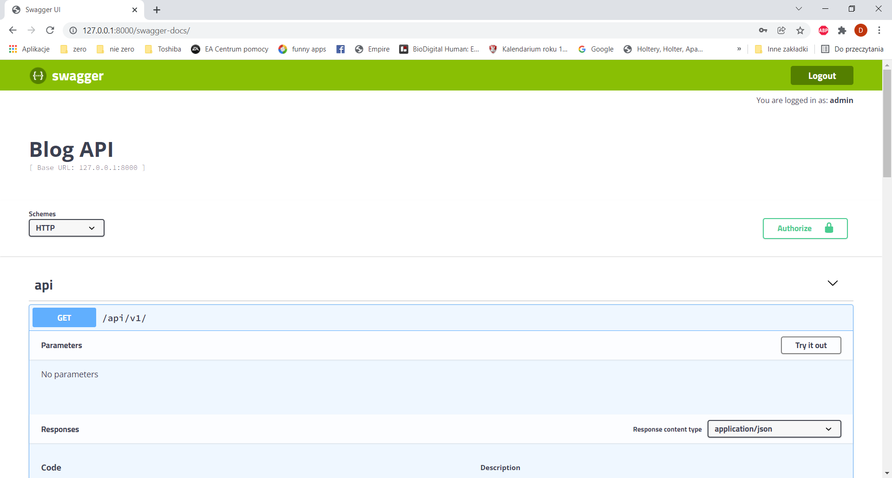
* Przykład testowania:
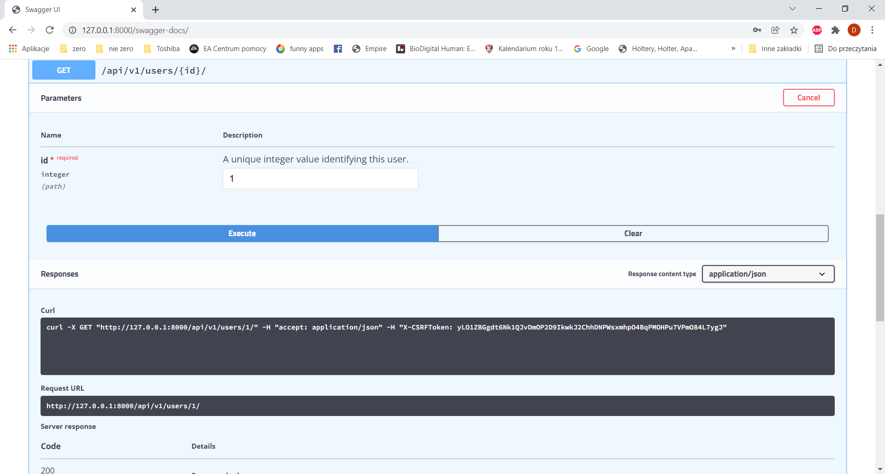
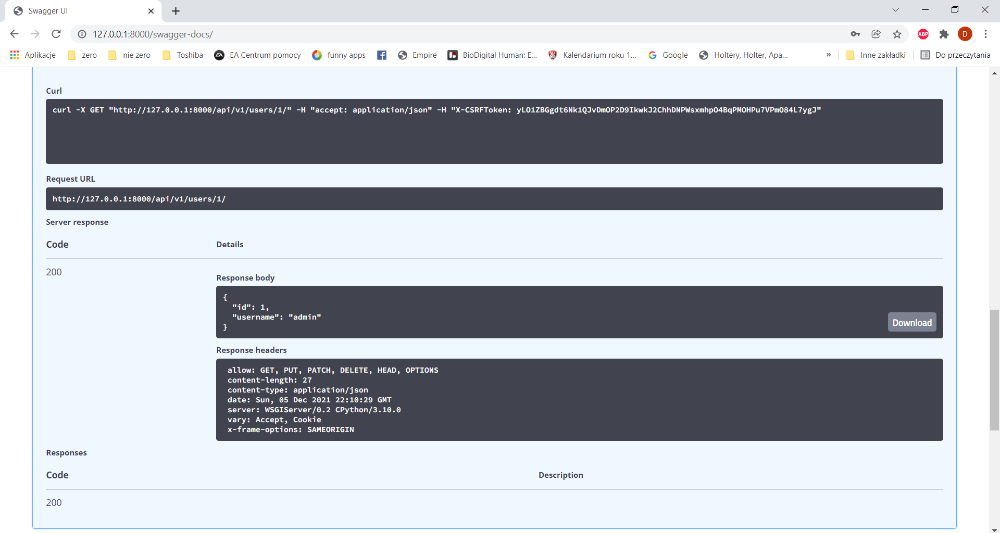