# Laboratorium nr 6 - Zezwolenia i uwierzytelnianie w DRF
1. Viewsets:
 Jako że jest to kontynuacja Laboratorium nr 4 to już w poprzednim zadaniu uwzględniłem obsługę viewsets do wyświetlania postów oraz listy użytkowników:
 

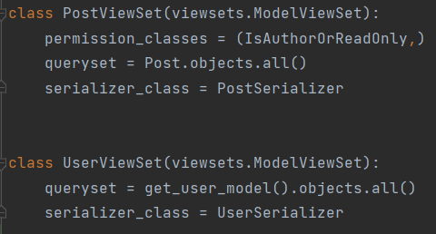

 

2. Routers:

 Podobnie jak w punkcie powyżej routers wykorzystałem w celu dodania ścieżki dla list postów oraz użytkowników:
 

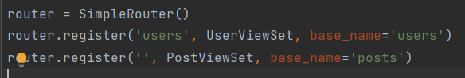

 

3. Serializer:
  Serializer został wykorzystany dla utworzenia listy użytkowników oraz postów:
 

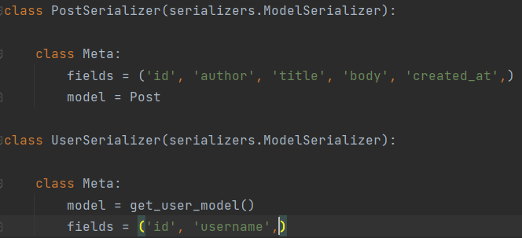

 

4. Uzyskany efekt:
 

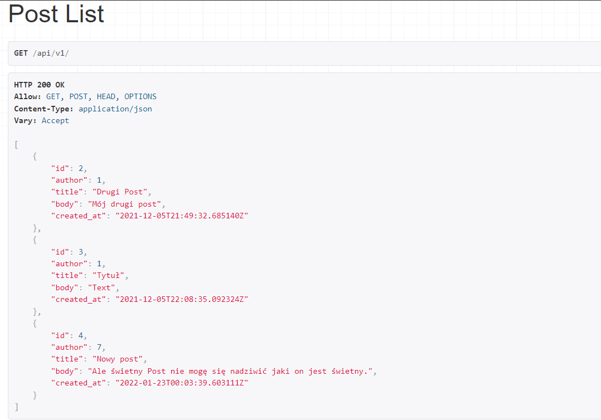

 

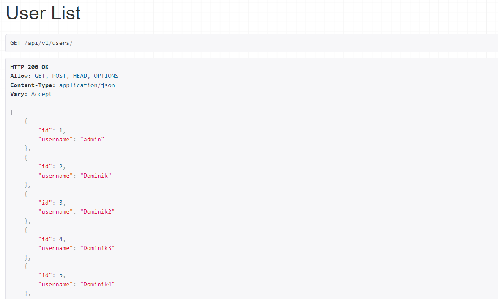

 

5. Uwierzytelnianie:
W sekcji 'DEFAULT_AUTHENTICATION_CLASSES' pliku 'settings' dodane zostały:
* SessionAuthentication,
* TokenAuthentication,
 

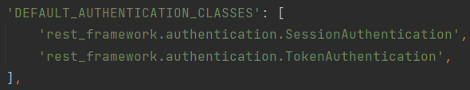

 
Następnie w celu zaimplementowania Token Authentication należy dodać aplikację authtoken w pliku settings:
 

 
Po dokonaniu powyższych kroków w panelu administratora pojawia się sekcja Tokens w której przechowywane będą tokeny wykorzystywane przy logowaniu oraz wylogowywaniu użytkowników:
 

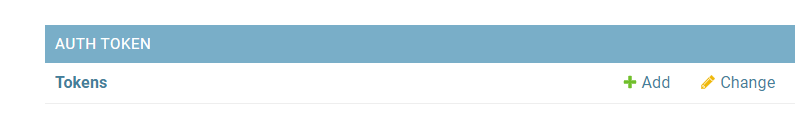

 
Kolejnym krokiem jest umożliwienie logowania oraz wylogowania użytkownika w tym celu w pliku settings dodane zostało 'rest_auth':
 

 
Po czym w pliku 'urls' dodana została ścieżka do 'rest_auth':
 

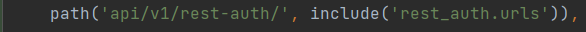

 
Po dodaniu tej ścieżki do pliku urls możliwe staje się logowanie oraz wylogowanie użytkownika poprzez ścieżki:
* ../rest-auth/login/
* ../rest-auth/logout/
 

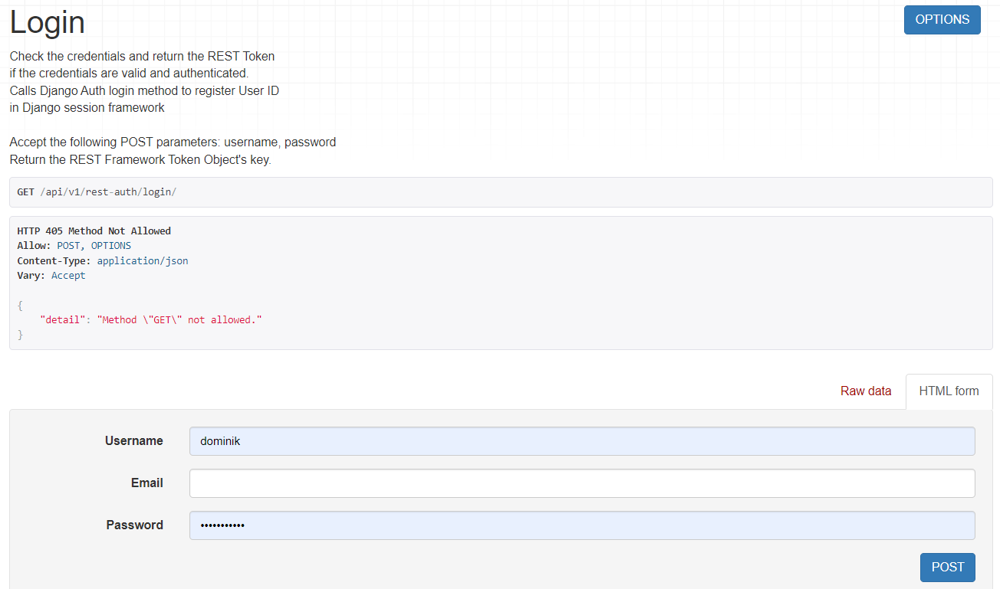

 

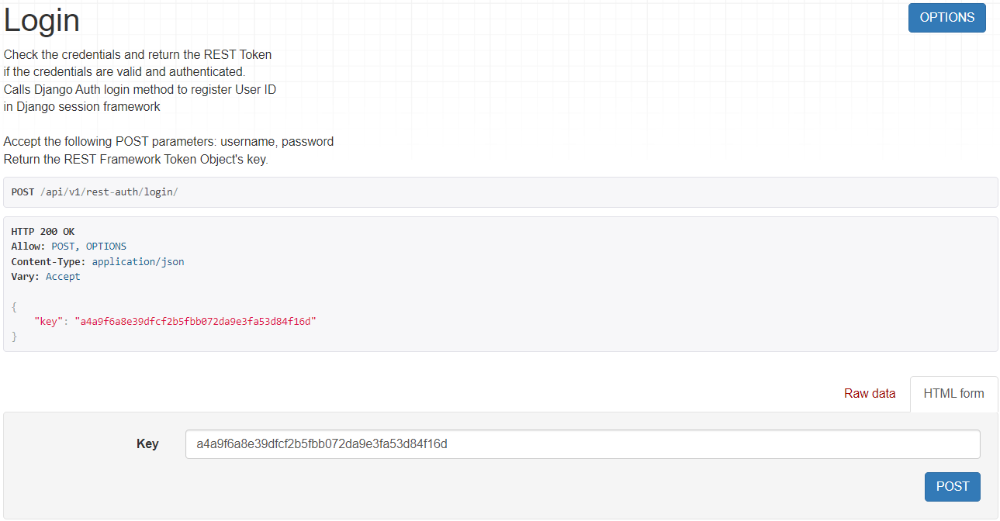

 
Jak widać logowanie przebiegło prawidłowo a w wyniku uzyskujemy token sesji użytkownika:
 

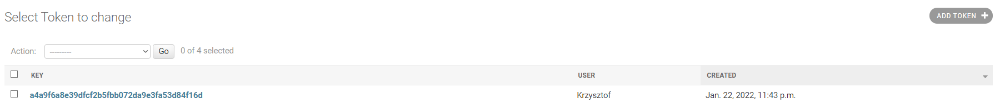

 

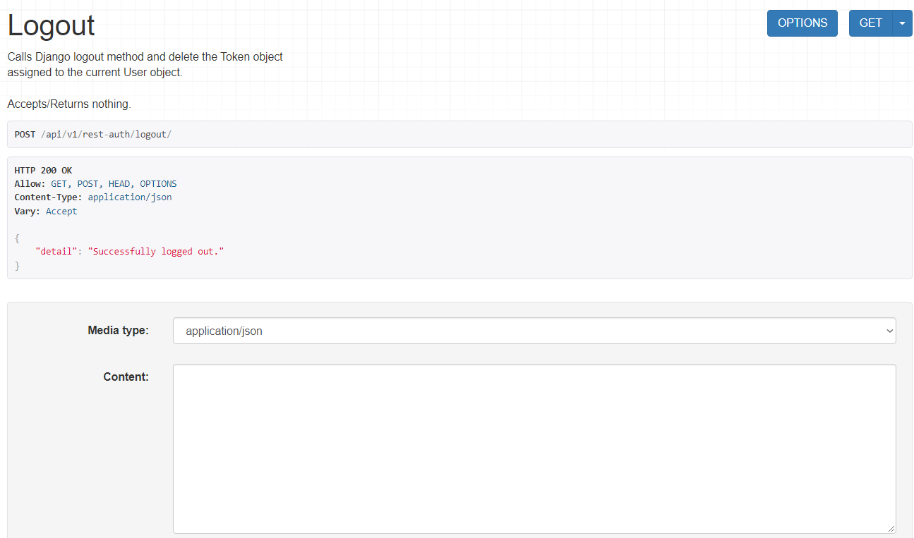

 
Jak widać wylogowanie użytkownika również przebiegło bez zarzutu.
 

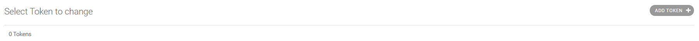

 
A token sesji użytkownika dłużej nie istnieje w zakładce Tokens w panelu administratora.

Oraz resetowanie hasła użytkownika poprzez:
* ../rest-auth/password/reset
 

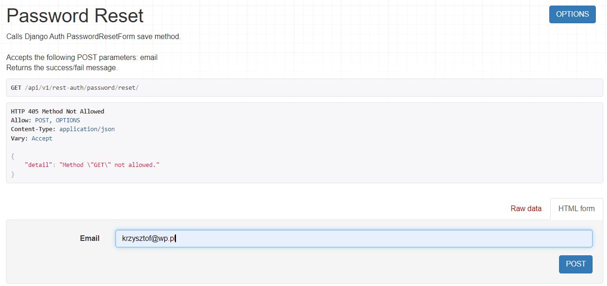

 

Następnie w celu utworzenia możliwości rejestracji nowego użytkownika wykorzystuję django-allauth oraz django.contrib.sites:

 

 

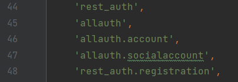

 

W celu wysyłania wiadomości E-mail potwierdzającej reset hasła wykorzystałem django.core.mail.backends:
 

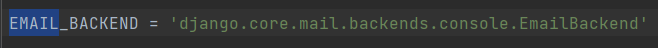

 

Dzięki tym krokom po przejściu we wcześniej zdefiniowaną ścieżkę otrzymuje możliwość zarejestrowania nowego użytkownika:

 

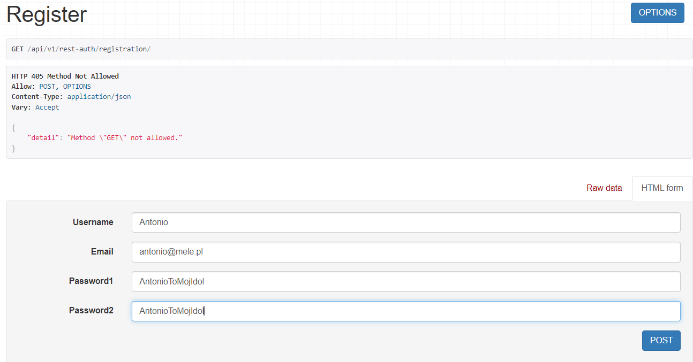

 

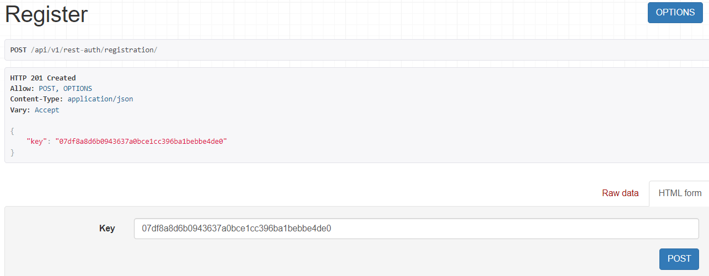

 

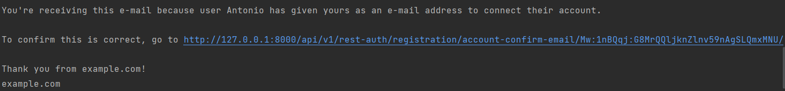

 

Jak widać rejestracja przebiegła pomyślnie a po zarejestrowaniu się w konsoli pojawia się treść Maila potwierdzającego rejestracje.

6. Prosty licznik odwiedzin strony z wykorzystaniem cookies:

W celu stworzenia licznika utworzyłem nowy widok o nazwie 'counter' po uprzednim zaimportowaniu bibliotek:

* `from datatime import datetime`
* `from django.http import HttpResponse`

 

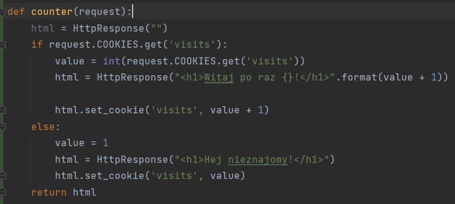

 

Po uprzednim dodaniu ścieżki w pliku 'url': `path('', counter, name="counter")`

Po odwiedzeniu strony po raz pierwszy wyświetlona zostanie informacja: `Witaj nieznajomy!` a po każdym kolejnym odświeżeniu strony będzie wyświetlała się informacja o liczbie odwiedzeń:
 

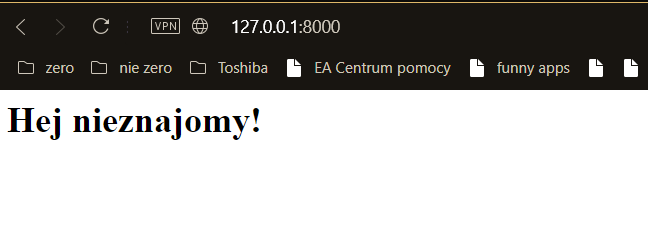

 

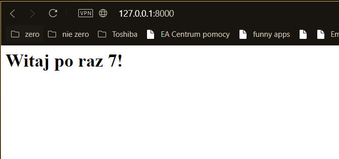